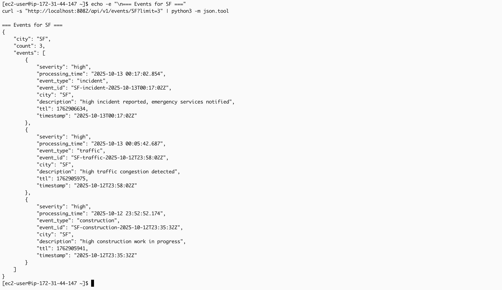

# Real-Time Event Streaming Pipeline

> **Production-ready distributed streaming platform** processing real-time city infrastructure events using Kafka, Spark Structured Streaming, and AWS services (EC2 + DynamoDB). Designed for scalable, fault-tolerant cloud deployment.

[](https://kafka.apache.org/)
[](https://spark.apache.org/)
[](https://aws.amazon.com/)
[](https://openjdk.org/)

[View Kubernetes Version →](https://github.com/rishaliype/Kubernetes-Native-Streaming-Platform-with-Observability)

---

## What This Demonstrates

**Distributed Systems:** Multi-service architecture with Kafka message queuing, Spark stream processing, and AWS cloud persistence

**Real-Time Processing:** Sub-second latency event processing with windowed aggregations and stateful computations

**Production Practices:** Containerization, health checks, monitoring endpoints, error handling, and cloud deployment

---

### Why the AWS Version?
This deployment focuses on cloud-native integration with AWS services — leveraging EC2 for compute scalability and DynamoDB for managed NoSQL storage. It complements the Kubernetes-native variant by demonstrating AWS-hosted deployment patterns.

---

## System Architecture

```
┌──────────────┐      ┌─────────┐      ┌────────────────┐      ┌──────────┐
│   Producer   │─────▶│  Kafka  │─────▶│ Spark Cluster  │─────▶│ DynamoDB │
│ (Spring Boot)│      │ (EC2)   │      │   (EC2)        │      │  (AWS)   │
└──────────────┘      │ Message │      └────────────────┘      └──────────┘
                      └─────────┘                                     │
                                                                      ▼
                                                              ┌─────────────┐
                                                              │  REST API   │
                                                              │ (Spring Boot│
                                                              │   on EC2)   │
                                                              └─────────────┘
```
**Pipeline Flow:** Events generated every 5s → Kafka buffering → Spark processes 4 concurrent queries → Data stored in 3 DynamoDB tables → REST API exposes results

---

## Key Features

### Stream Processing
- **Windowed Aggregations:** 5-minute tumbling windows with event counts and severity tracking
- **Real-time Alerts:** Dedicated stream filtering high/critical severity events  
- **Watermarking:** 10-minute threshold for handling late-arriving data
- **Checkpointing:** Fault-tolerant state management for recovery

### Data Storage
- **Optimized Schema:** Composite keys (partition + sort) for efficient queries
- **Multiple Tables:** Separate tables for raw events, aggregations, and alerts
- **TTL Management:** Automatic 30-day data expiration
- **Cost Efficient:** On-demand pricing with ~$1/month DynamoDB costs

## Key Components

### 1. Producer (`citystream-producer`)
- Generates synthetic city events every 5 seconds
- Event types: traffic, weather, incident, construction
- Cities: NYC, LA, Chicago, SF, Boston, Seattle
- Severity levels: low, medium, high, critical
- Publishes to Kafka topic `city-events`

### 2. Kafka Cluster
- **Zookeeper**: Manages Kafka cluster coordination
- **Kafka Broker**: Single broker setup for demo
- Topic: `city-events` (auto-created)
- Retention: 24 hours

### 3. Spark Consumer (`citystream-consumer`)
Processes four streaming queries simultaneously:

#### Query 1: Raw Events Storage
- Reads from Kafka, parses JSON events
- Writes to `citystream-raw-events` table
- Adds TTL (30 days) for automatic cleanup
- Keys: `event_id` (partition), `timestamp` (sort)

#### Query 2: Windowed Aggregations
- 5-minute tumbling windows
- Groups by: window, city, event_type
- Aggregates: count, severity list
- Writes to `citystream-aggregations` table
- Uses watermark (10 minutes) for late data handling

#### Query 3: High-Severity Alerts
- Filters events with severity = "high" or "critical"
- Writes to `citystream-alerts` table
- Keys: `city` (partition), `timestamp` (sort)
- Real-time alerting for critical situations

#### Query 4: Console Monitoring
- Live dashboard in Spark console
- Shows aggregated counts by city/type/severity

### 4. DynamoDB Tables

#### `citystream-raw-events`
- **Partition Key**: `event_id` (String)
- **Sort Key**: `timestamp` (String)
- **TTL**: 30 days
- **Purpose**: Store all raw events

#### `citystream-aggregations`
- **Partition Key**: `partition_key` (String) - format: `city#event_type#window_start`
- **Attributes**: window_start, window_end, event_count, severities, city, event_type
- **Purpose**: Pre-computed analytics

#### `citystream-alerts`
- **Partition Key**: `city` (String)
- **Sort Key**: `timestamp` (String)
- **Purpose**: Quick access to high-priority alerts by city

### 5. REST API (`citystream-api`)

Endpoints:
- `GET /api/v1/health` - Health check
- `GET /api/v1/events/{city}?limit=20` - Recent events for a city
- `GET /api/v1/summary/{city}` - Aggregated summary
- `GET /api/v1/alerts?city={city}&hours=24` - Recent alerts
- `GET /api/v1/cities` - List all cities with event counts
- `GET /api/v1/aggregations?city={city}&event_type={type}&limit=10` - Windowed aggregations
- `GET /api/v1/stats` - Overall statistics
---

## Screenshots & Pipeline in Action

### AWS Infrastructure Configuration

*Security group inbound rules for the citystream-sg, showing 9 permission entries configured for the streaming pipeline. Port access includes Spark Master (7077), Spark UI (8080, 8081), REST API (8082), Kafka (9092, 9093), Zookeeper (2181, 3888), Prometheus (9090), and SSH (22). Rules demonstrate proper network isolation with controlled access from specific IP ranges and 0.0.0.0/0 for public services.*


*Production EC2 instance (citystream-working) running on c7i-flex.large in us-east-2c availability zone. Instance shows Running state with 3/3 status checks passed, demonstrating healthy compute infrastructure for the distributed streaming platform. Details include instance ID, reservation, and VPC configuration for cloud-native deployment.*

### Pipeline Deployment & Service Health

*Docker Compose orchestration showing all seven services in healthy state: API, Kafka, Producer, Spark Master/Worker, and Zookeeper. Two snapshots (38 seconds and 1 minute uptime) demonstrate service stability and successful startup sequence. Port mappings visible for each service confirm proper container networking and external accessibility.*


*Live SSH session on Amazon Linux 2023 EC2 instance showing successful docker-compose deployment. Terminal displays all containers running with their respective images, commands, and port configurations. The citystream directory structure and docker-compose ps output verify complete service orchestration on the cloud environment.*

### Event Generation & Kafka Message Queue

*Spring Boot producer logs showing scheduled event generation at 5-second intervals. Each log entry displays event creation with randomized attributes (city, event_type, severity) followed by Kafka send confirmation with partition assignment and latency metrics (3-11ms range). Sample events include traffic, weather, incidents, and construction across NYC, LA, SF, Boston, Chicago, and Seattle.*


*Kafka console consumer displaying real-time message flow from the city-events topic. Shows JSON event payloads with complete schema (event_id, timestamp, city, event_type, severity, description) streaming from the producer. Five sample events demonstrate diverse event types across multiple cities with varying severity levels, confirming successful producer-to-Kafka connectivity.*

### Stream Processing & Windowing

*Spark Structured Streaming console output displaying real-time micro-batch processing (Batches 68-73). Table format shows aggregated event counts grouped by city, event_type, and severity. Data demonstrates stateful aggregations across multiple cities with event counts ranging from 1-4 per group, confirming successful stream processing and query execution.*


*5-minute tumbling window aggregations from Spark streaming (Batches 70-74). Results show windowed event counts grouped by city, event_type, and severity with clear time boundaries. Demonstrates advanced streaming features including watermarking for late data handling and stateful computations maintaining counts across micro-batches.*

### REST API Demonstrations

*REST API /aggregations endpoint returning NYC traffic event windowed analytics (limit 5). JSON response includes partition keys, window start/end times, event counts, city, event_type, and severity arrays. Data shows multiple 5-minute windows with event counts of 1-2 and severity levels (medium, high), demonstrating pre-computed statistics from DynamoDB.*


*City summary endpoint for Los Angeles showing comprehensive event statistics. Response includes total_events (111), generated_at timestamp, and event_type_breakdown with counts: weather (30), construction (30), incident (21), traffic (30). Demonstrates multi-table aggregation queries providing operational dashboard insights.*


*San Francisco recent events endpoint (limit 3) returning raw event data from DynamoDB. JSON response shows three events with complete details including severity, processing_time, event_type, event_id, city, description, ttl, and timestamp. Events include high-severity incident and traffic alerts, demonstrating efficient partition key queries.*


*High-severity alerts endpoint for Chicago with 2-hour time filter. Response shows multiple critical and high priority alerts including traffic congestion, construction work, and emergency incidents. Each alert includes severity, processing_time, event_type, event_id, city, description, and timestamp, demonstrating the dedicated alerts stream and efficient time-range queries.*


*System-wide alerts endpoint aggregating critical and high-priority events across all cities (Seattle, Chicago). JSON response shows multiple construction, incident, and traffic alerts with timestamps. Demonstrates cross-partition scanning capabilities and real-time alerting infrastructure for operational incident response and monitoring.*

---

## Tech Stack

| Layer | Technology | Purpose |
|-------|-----------|---------|
| **Stream Processing** | Apache Spark 3.4.1 | Real-time data transformations |
| **Message Queue** | Kafka 7.5.0 | Event buffering & ordering |
| **NoSQL Database** | AWS DynamoDB | Low-latency storage |
| **Application** | Spring Boot 3.x | Event generation & API |
| **Infrastructure** | Docker Compose | Multi-container orchestration |
| **Cloud** | AWS EC2 (c7i-flex.large) | Production deployment |

---

## 🚀 Quick Start

### Prerequisites
- AWS account with DynamoDB access
- Docker Desktop
- Java 17+, Maven 3.8+

### Deploy in 5 Commands

```bash
# 1. Create DynamoDB tables
./setup-dynamodb.sh

# 2. Build applications
mvn clean package

# 3. Start infrastructure
docker-compose up -d

# 4. Submit Spark job
docker exec citystream-spark-master /opt/spark/bin/spark-submit \
  --class com.citystream.consumer.SparkDynamoDBConsumer \
  --master local[4] \
  /opt/spark-work-dir/consumer-1.0.0.jar

# 5. Verify pipeline
curl http://localhost:8082/api/v1/stats
```

---
## Operational Patterns

### 1. Stream Processing Patterns
- **Tumbling windows**: Fixed-size, non-overlapping time windows
- **Watermarking**: Handling late-arriving data
- **Stateful streaming**: Maintaining aggregations across micro-batches
- **Fault tolerance**: Checkpointing for exactly-once processing

### 2. Kafka Integration
- Producer with proper serialization
- Consumer group management
- Topic partitioning strategies
- Offset management

### 3. Spark Structured Streaming
- DataFrame/Dataset API for streaming
- ForeachWriter for custom sinks
- Multiple concurrent queries
- Output modes: append, update, complete

### 4. DynamoDB Design
- Choosing partition and sort keys
- Query patterns (scan vs query vs get-item)
- TTL for automatic data expiration
- Efficient data modeling for time-series

### 5. Docker Orchestration
- Multi-container applications
- Service dependencies
- Health checks
- Volume management
- Network configuration

### 6. AWS Deployment
- EC2 instance sizing for Spark workloads
- Security group configuration
- IAM roles and permissions
- Cross-service integration (EC2 + DynamoDB)

---

## Testing

```bash
# Verify producer is generating events
curl http://localhost:8080/metrics

# Check Kafka topic
docker exec citystream-kafka kafka-console-consumer \
  --topic city-events --bootstrap-server localhost:9092 --max-messages 5

# Query DynamoDB
aws dynamodb scan --table-name citystream-raw-events --max-items 3

# Test REST API
curl http://localhost:8082/api/v1/events/NYC?limit=5
```

---

## Skills Demonstrated

**Distributed Stream Processing** - Kafka + Spark Structured Streaming  
**NoSQL Database Design** - DynamoDB schema optimization  
**REST API Development** - Spring Boot with 7 production endpoints  
**Docker Orchestration** - Multi-container application with health checks  
**AWS Cloud Services** - EC2, DynamoDB, IAM, CloudWatch  
**Real-time Windowing** - Tumbling windows with watermarking  
**Fault Tolerance** - Checkpointing and stateful recovery  
**Production Deployment** - Cloud infrastructure

---

## Related Projects

- **[Kubernetes-Native Streaming Platform](https://github.com/rishaliype/Kubernetes-Native-Streaming-Platform-with-Observability)** - Same pipeline deployed on Kubernetes with Prometheus monitoring

---

This project demonstrates production-ready patterns for stream processing, cloud deployment, and NoSQL at scale.

---

**Built with:** Java 17 • Spring Boot • Apache Kafka • Apache Spark • AWS DynamoDB • Docker
